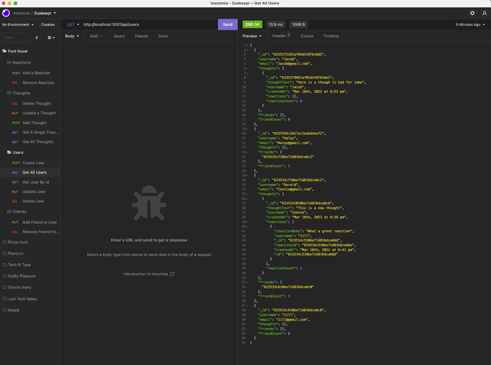

# Foot Novel (Social Media API)

## Description

Foot novel is a Social Media API that allows you to use MongoDB and Mongoose to interact with an API and database. This API allows you to create a user, update a user, and remove a user. Additoinally, you can add friends to users or remove friends from users. User can create thoughts, edit thoughts, and delete thoughts, and their friends can add or remove reactions.

## Table of Contents

- [Installation](#installation)
- [Usage](#usage)
- [Credits](#credits)
- [License](#license)

## Installation

In order to run this project locally you'll want to do the following:

1. Clone the Repo
2. run `npm i`
3. run `npm start` to start the server
4. Then you can use Insomnia to test the different routes associated with the 

## Usage

You can use this project to:

* Create new users
* Give them Friends
* All users to add Thoughts
* Allow users to add reactions to thoughts
* You can update Users, Thoughts, and Reactions
* You can delete Users, Thoughts, and reactions

Additionally, you can watch a video walkthrough of this API here:
https://drive.google.com/file/d/13iGEdLpl5pXKnzszM6uqMVRuiEzXFmnW/view 

Below is a screenshot of the Get All Users route that displays Users, Friends, Thoughts and Reactions:

## Credits

* [Mongoose](https://mongoosejs.com/)  
* [Express](https://expressjs.com/)

## License

MIT License

Copyright (c) [2022] [Emily Dokken]

Permission is hereby granted, free of charge, to any person obtaining a copy
of this software and associated documentation files (the "Software"), to deal
in the Software without restriction, including without limitation the rights
to use, copy, modify, merge, publish, distribute, sublicense, and/or sell
copies of the Software, and to permit persons to whom the Software is
furnished to do so, subject to the following conditions:

The above copyright notice and this permission notice shall be included in all
copies or substantial portions of the Software.

THE SOFTWARE IS PROVIDED "AS IS", WITHOUT WARRANTY OF ANY KIND, EXPRESS OR
IMPLIED, INCLUDING BUT NOT LIMITED TO THE WARRANTIES OF MERCHANTABILITY,
FITNESS FOR A PARTICULAR PURPOSE AND NONINFRINGEMENT. IN NO EVENT SHALL THE
AUTHORS OR COPYRIGHT HOLDERS BE LIABLE FOR ANY CLAIM, DAMAGES OR OTHER
LIABILITY, WHETHER IN AN ACTION OF CONTRACT, TORT OR OTHERWISE, ARISING FROM,
OUT OF OR IN CONNECTION WITH THE SOFTWARE OR THE USE OR OTHER DEALINGS IN THE
SOFTWARE.